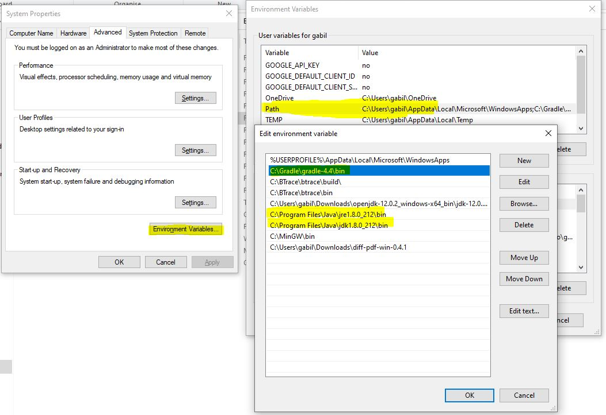

# Ground-truth extractor

## First steps

* Clone this repository: `git clone https://github.com/GabrielaMichelon/git-ecco.git`
* Checkout to branch challenge: `git checkout challenge`
* Clone the git reposiritory of the target sytems in a folder on your computer
 - LibSSH git repository: https://gitlab.com/libssh/libssh-mirror.git
 - Irssi git repository: https://github.com/irssi/irssi.git
 - Marlin git repository: https://github.com/MarlinFirmware/Marlin

## Requires

* JDK 8
* [Gradle](http://gradle.org/ "Gradle") &#8805; 4.4 as build system

You can add jdk and gradle as environmental variables to make easier the script execution in the command line:

## Ground-truth feature location

* In `module challenge` uncomment in [build gradle](https://github.com/GabrielaMichelon/git-ecco/blob/challenge/challenge/build.gradle) file the line: *main = variantsWithFeatures*

* Parameters
  - **First paramenter**: the Git project folder
  - **Second paramenter**: the results folder
  - **Third parameter**: number of Git commit for mining variants with features
  - **Fourth parameter**: **'0'** for using the scenarios and new configurations available in the benchmark, **'1'** for generating scenarios with input configurations, **'2'** for generating new configurations or **'3'** for generating both input and new configurations
  - **Fifth parameter**: **'0'** for not preprocessing any variant, **'1'** for preprocessing input configurations, **'2'** for preprocessing new configurations or **'3'** for preprocessing both input and new configurations
  - **Sixth parameter**: 'false' for identifying features (when you do not provide a txt with the features), '\<the txt directory>' to use your defined features (provide a txt with features with following structure: {"WITH_SERVER","HAVE_LIBZ",...} )
  - **(optional)** seventh and eighth parameter: number of input configurations (benchmark uses 300) and number of new configurations (benchmark uses 50)
 

* Folder where the ground-truth extraction of the target system project will be stored on your computer

* Type the following command in a command line for **LibSSH system**
  - gradle run -Pmyargs ='\<folder git repository>','\<results folder>','5035','3','0','false'
  
  
* Type the following command in a command line for **Irssi system**
  - gradle run -Pmyargs ='\<folder git repository>','\<results folder>','5331','3','0','false'

## Ground-truth feature revision location

* In `module challenge` uncomment in [build gradle](https://github.com/GabrielaMichelon/git-ecco/blob/challenge/challenge/build.gradle) file the line: *main = variantsWithFeatureRevisionsClass*

* Parameters
  - **First paramenter**: the Git project folder
  - **Second paramenter**: the results folder
  - **Third parameter**: number of Git commit to start mining variants
  - **Fourth parameter**: number of Git commit to finish mining variants
  - **Fifth parameter**: **'false'** for mining and preprocessing input configurations, **'true'** for mining and preprocessing new configurations
  - **Sixth parameter**: **'false'** for identifying features (when you do not provide a txt with the features), '\<the txt directory>' to use your defined features (provide a txt with features with following structure: {"WITH_SERVER","HAVE_LIBZ",...} )

* Type the following command in a command line for **mining input configurations**
  - gradle run -Pmyargs='\<folder git repository>','\<results folder>','0','100','false','false'

* Type the following command in a command line for **mining new configurations**
  - gradle run -Pmyargs='\<folder git repository>','\<results folder>','0','100','true','false'

## Generating variants with configurations defined

* If you want to create your own configurations to preprocess variants In `module challenge` uncomment in [build gradle](https://github.com/GabrielaMichelon/git-ecco/blob/challenge/challenge/build.gradle) file the line: *main = generateNewConfigurationsFromFile*

* Parameters
  - **First paramenter**: the Git project folder
  - **Second paramenter**: the directory containing the csv file where each line must contains in every line a configuration like in the example below:

  

* Type the following command in a command line for **Irssi system**
  - gradle run -Pmyargs='\<folder git repository>','\<configuration csv folder>'

## Ground-truth compute metrics

* In `module challenge` uncomment in [build gradle](https://github.com/GabrielaMichelon/git-ecco/blob/challenge/challenge/build.gradle) file the line: *main = computeMetricsClass*

* **Important information**: You will have a folder where the input configurations were preprocessed called "inputConfigurations" and you will have a second path where you stored the variants obtained after composing the configurations in a "output" folder. In the case of computing metrics for NEW configurations, you have to type in the command line the first folder directory as `newConfigurations` path and output of new configurations is your `<output_newConfigurations>` path.

* Type the following command in a command line for **Irssi system**
  - gradle run -Pmyargs='\<input path>','\<output path>'
